# Shipping Network Optimization with Reinforcement Learning: A Simple Example


**Team members** 

* **Leaders** 
    1. **Hong Ming Tan**: Senior Lecturer, Deputy head of DAO

    2. **Qinghe Sun**: Assistant Professor of Hong Kong Polytechnic University in Maritime Logistics, Supply Chain Resilience

    3. **Jussi Keppo**: Head of DAO and Professor of IORA

* **Full-time team members** 
    1. **Xuefei Liu**: Staff of IORA
    1. **Linsheng Zhuang**: PhD student of IORA


## 0. Motivation

Two targets

1. Given the current ports and lines, how to make adjustments to reduce the total operations cost (**Line Optimization**)
2. Given the lines, how to allocate vessels, schedule the visiting time, and allocate cargos. (**Link to the Applications**)

### Some Observations

- Line Optimization is a **sequential decision**. 

    Trajectory: $S_0$, $a_1\in \mathcal{A}_1(S_0)$, $S_1$, $a_2\in\mathcal{A}(S_1)$, .... 

- Why?

    Curse of dimensionality

- Reinforcement learning? AlphaGo?

    Not really applicable: the mind is too "deep"...

- Our algorithm is a myopic version of AlphaZero


## 1. Prototype

The purpose of this project is to give the best "adjustment" of the current network, including lines and the arrangements of ships (amount and calender). 

Due to the complexity, we divide the problem into 4 layers:

- In layer 0, we solve an approximated cost function given lines and weekly demand rate. 

    (for Target 1) 

- In layer 1, we focus only on the line generation problem given the approximated cost function. 

    (for Target 1) 

- In layer 2, we build NN to learn the optimal service graph adjustment policy. 

- In layer 3, we solve the remaining demand fulfillment problems and scheduling problem of ships given the generated lines. 

    (for Target 2) 


### Layer 0: Approximate the minimum cost

The purpose of layer 0 is to provide an **approximated** cost function for layer 1, given the network of lines and weekly demand rate as input. 

The key problem of this layer to be solved is the **cargo allocation problem** (or "demand fulfillment problem"). We don't concern more detailed problems like how many vessels to be assigned to each line, and the calender of each ship. Instead, we only consider the **average capacity** of each line of a week, using the average demand of a week. 

The optimization problem of layer 0 can be abstractly represented by 
$$
\text{Cost}(G)\ =\ \text{the sum of}\quad \begin{cases}
\text{chartering cost},\\
\text{bunkering cost},\\
\text{transshipment cost},\\
\text{port call cost}
\end{cases}
$$

subject to 

- The average demand of a week are all all fulfilled. 

We will eastimate all these costs with the simplest measurement on ==line level==. 


### Layer 1: Service Line design

The purpose of Layer 1 is to design lines. 

The optimization problem of layer 1 can be abstractly represented by 
$$
\min_{\text{actions}} \text{Cost}(G)
$$

where $G=\{T1, T2, ...\}$ means network of lines, and **actions** includes

- Adding ports into lines
- Removing ports from lines
- Creating new lines

The **Cost** function is derived by layer 0. Here, we just take it as a given blackbox. 

This is a network optimization problem. In traditional OR, people typically solve this problem by **MILP**. However, for such a complex problem, mixed interger optimization programming algorithm is usually intractable. Instead, people have to either simplied their model or resort to some heuristic method to simplify the calculation. 

We solve the problem by Monte Carlo Tree Searching (MCTS) algorithm. 


### Layer 2: Neural Network

Based on the above Monte Carlo Tree, we build NN to learn the optimal adjustment policy for any given lines. 


(The coding part is done already. We just need some resources to train the neural network.)


### Layer 3: Ship Level Decision

Layer 2 is a finer version of layer 0. Remember that in Layer 0, we only measure the efficiency of the line using average demand rates and capacity of whole line. 

Here, we move on to the vessel level, solving the 

- Demand Fulfillment Problem
  - Allocation of demands
  - Arrangement of ships: how many ships (of each classes) are arranged to each line
- Scheduling Problem of Each Vessel
  - The speed of ships on the whole line
  - Calendar

The main difference of Layer 2 and Layer 0 is the ***granularity*** of the problem. In layer 0, we only consider the line level optimization, but here we consider ship level optimization. 

The optimization problem of layer 2 is still represented by 
$$
\text{Cost}(G)\quad \text{includes}\quad \begin{cases}
\text{chartering cost},\\
\text{bunkering cost},\\
\text{transshipment cost},\\
\text{port call cost}
\end{cases}
$$

subject to

- Demands are all fulfilled
- Vessel call a port on the same day (of week)

- Others...


## 2. Atoms

In this section, we define the notations of this model. These are the basis of this huge model. 

### 2.1. Port

In Python code, all ports related class and methods are defined in `port.py` file. There are three classes

- `Port`: containing attributes of each port
- `PortsPool`: the collection of all ports that we consider in this model
- `PortGraph`: the mutual relation (distance, demand) among ports. 


#### (1) The Pool of All Ports

In the simple example, we consider 7 ports. 

The pool of all ports is denoted by $\mathcal{I} = \{P1, P2, P3, P4, P5, P6, P7\}$.

These 7 ports are 

- P1(HK)
- P2(DaNang)
- P3(HoChiMinh)
- P4(Singapore)
- P5(Jakarta)
- P6(Kaohsiung)
- P7(Keelung)

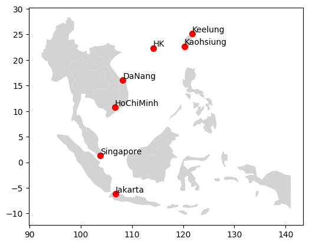


#### (2) Port Attributes: P1(HK) as an example

- ID: P1
- Name: Hongkong
- Location (longitude, latitude): (114.177216, 22.3193).
- Max Port Draft
  - For simplicity, we just assume that all port draft are **infinity**.
- Transshipment cost and time per TEU of goods.
  - Port "P1" transships 1 TEU of goods at cost 10000 in one day.
- Port call cost for each vessel class per time unit.
  - For example, port "P1" allows for vessel classes 1, 2, 3 to call with cost 10000, 20000, 30000 per day.
  - We can calculate an **average** port call cost rate to eliminate classes.


#### (3) Addional Information on Ports

- Mutually Relative Distances: (Source: http://ports.com/sea-route and https://www.prokerala.com/travel/distance/)

|      | P1   | P2   | P3   | P4   | P5   | P6   | P7   |
| ---- | ---- | ---- | ---- | ---- | ---- | ---- | ---- |
| P1   | -    | 667  | 1065 | 1396 | 1762 | 414  | 590  |
| P2   | 667  | -    | 506  | 1273 | 1327 | 1043 | 1240 |
| P3   | 1065 | 506  | -    | 775  | 1017 | 1432 | 1629 |
| P4   | 1396 | 1273 | 775  | -    | 482  | 2126 | 2314 |
| P5   | 1762 | 775  | 1017 | 482  | -    | 1894 | 2531 |
| P6   | 414  | 1017 | 1432 | 2126 | 1894 | -    | 232  |
| P7   | 590  | 482  | 1629 | 2314 | 2531 | 232  | -    |

Notation: $m^{(i,j)}$.

- Mutual Demand Flow in a Week (I made up the data, unit: TEU)

|           | P1 (to) | P2 (to) | P3 (to) | P4 (to) | P5 (to) | P6 (to) | P7 (to) |
| --------- | ------- | ------- | ------- | ------- | ------- | ------- | ------- |
| P1 (from) | -       | 520     | 660     | 350     | 780     | 390     | 440     |
| P2 (from) | 1030    | -       | 2043    | 170     | 498     | 540     | 532     |
| P3 (from) | 2300    | 1890    | -       | 260     | 339     | 270     | 709     |
| P4 (from) | 650     | 650     | 890     | -       | 587     | 358     | 375     |
| P5 (from) | 820     | 279     | 421     | 390     | -       | 576     | 299     |
| P6 (from) | 460     | 345     | 120     | 260     | 425     | -       | 804     |
| P7 (from) | 680     | 301     | 290     | 180     | 201     | 1023    | -       |

Notation: $D^{(o,d)}$.


### 2.2. Service

#### (1) Service Attributes

- Line: $(1,2,3,4)$.
  - See the section "Routine Types" below for explanations.
- Number of vessels of different classes
  - Class 1: 1 ship
  - Class 2: 2 ships
  - Class 3: 1 ship


#### (2) Routine Types

In Stefan Guericke PhD Thesis section 2.3, there are basically 4 types:

- Pendulum: $1\to2\to1$.
  - Expressed by $(1,2)$.
- Cyclic: $1\to 2 \to 3 \to 1$.
  - Expressed by $(1,2,3)$.
- Butterfly: $1\to2\to1\to3\to1$.
  - Expressed by $(1,2,1,3)$.
- Conveyor belt: $1\to2\to3\to4\to3\to2\to1$.
  - Expressed by $(1,2,3,4,3,2)$.

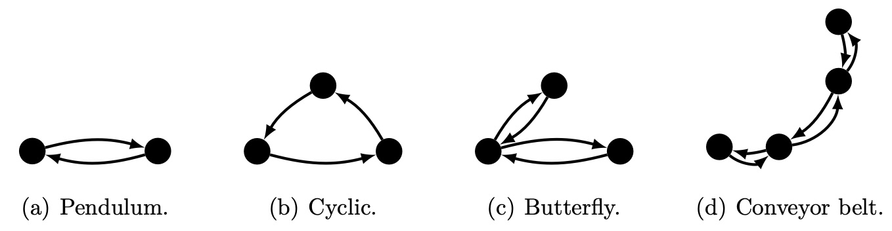

#### (3) Restrictions

All these types can be expressed by the sequence of ports with some addition rules:

- Rule 1: the neighbor of every port should be different
  - We rule out $(1,2,2)$ which is expanded to $1\to2\to2\to1$.
  -  We rule out $(1,2,1)$ which is exapnded to $1\to2\to1\to1$.

- Rule 2 (to be discussed): there must be at least **two** segments between identical segments
  - We rule out $(1,2,3,2,3)$ which is expanded to $1\to2\to3\to2\to3\to1$. In this example, the slot $2\to3$ appears twice, making the line a little bit duplicated.
  - We allow for $(1,2,3,4,2,3)$ which is expanded to $1\to2\to3\to4\to2\to3\to1$. There are 2 slots between two $2\to3$.
- Rule 3: every port $p$ can be visited at most $n_p$ times.
  - We can tune the parameter $n_p$ to reduce the size of action spaces
  - For important ports like singapore, $n_p$ can be set high, while for other ports, we can set $n_p$ low.


#### (3) Vessel

Each vessel has the following attributes

- rank

- capacity (TEU)

- draft (meters)

- daily chartering cost

- bunkering cost function, represented by a linear form $L = (b_0, b_1, b_2)$. Hence, the bunkering cost can be calculated by
  $$
  \text{Bunkering Cost} = b_0 + b_1 v + b_2 v^2
  $$
  where $v$ is speed (KTS). Currently, we assume $b_2 = 0$ for simplicity.


#### (4) A Simple Example:

##### (1) Service 1: Cyclic

- Notation: $T_1 = (1,2,3,4)$.

- Expanded Form $|T_1| = \{(1,2), (2,3), (3,4), (4,1)\}$.

- Ships: $(1, 2, 1)$.

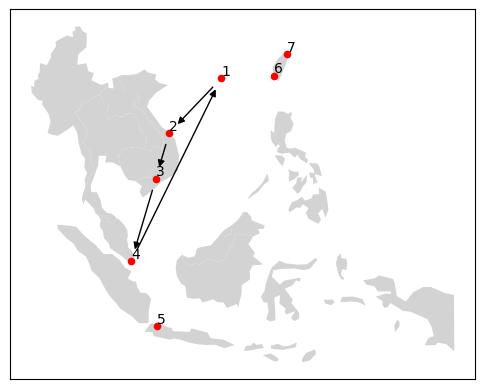


##### (2) Service 2: Cyclic

- Notation: $T_2 = (1,4,5,6,7)$.

- Expanded Form $T_2 = \{(1,4), (4,5), (5,6), (6,7), (7,1)\}$.

- Ships: $(1, 2, 1)$.

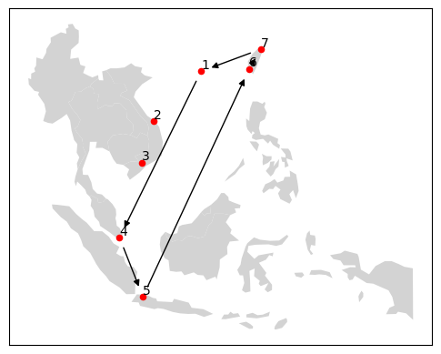


## 3. How to Calculate the Total Cost?

### 3.0. Preparation: Path

Given the services $T_1$ and $T_2$, we can search all paths that connects $(o,d)$:

- Define $\mathcal{P}_{o,d}$ the set of all connected paths that is not circled
  - Every path $p\in\mathcal{P}_{o,d}$ contains a set of line segments $(i,j)$ in either service $|T_1|$ or service $|T_2|$.
  - A path that connects $(o,d)$ can contains edges of different services.
  - Given the path $p$, we know the following information
    - Whether a slot $(i,j)$ is included in the path
    - If $(i,j)$ is included, which service provides the connection.

***Example:*** Demand from port `P4` to `P1` can be fulfilled by two paths, either $(4,1)$ by service 1 or $(4,5,6,7,1)$ by service 2.

- We use **greedy algorithm** to search all paths for every $(o,d)$ pair.
  - See `_get_paths(...)` method of class `ServiceGraph` in `servicegraph.py` file.


### 3.1. Decision Variables

#### (1) Demand Fulfillment and Flow

- The fullfilment of demand from $o$ to $d$ with path $p$  (unit TEU): $x^{(o,d,p)}$.
  - If there are two paths connects $(o,d)$, say $p_1$ and $p_2$, then there are two variables $x^{(o,d,p_1)}$ and $x^{(o,d,p_2)}$ to represents the fulfillment by each path **in a week**. There are as many demand fulfillment variables as there are paths in the network. They are one to one mapping.
  - Maybe it takes 2 weeks to finish the path $p$, but we consider the ***average*** concept: How many goods go through path $p$ on average in a week.
- The flow from $i$ to $j$ by service $k$ (unit TEU) **in a week**, where $(i,j)$ is a line segment: $y^{(i,j)}_k$, $k=1,2$.
  - If there exists a slot $(i,j)$ in $T_1\cup T_2$, then there is a flow variable $y^{(i,j)}$. There are as many flows as there are edges in the network. They are one to one mapping.

***Constraint 1.*** Variable Transformation between Flow and Demand Fulfillment:
$$
y_1^{(i,j)}+y_2^{(i,j)} \ge \sum_{o\not=d}\sum_{(i,j)\in p}x^{(o,d,p)},\quad\forall (i,j)\in T_1\cup T_2
$$

#### (2) Vessels, Speed and Duration

- The number of each class of vessels in service 1: $s^1_1, s^2_1, s^3_1$, and in service 2: $s^1_2, s^2_2, s^3_2$. Here, these decision variables are all **integers**.
- Speed: $v^{(i,j)}_1$ and $v_2^{(i,j)}$ for all line segments $(i,j)$. It means the **speed** from $i$ to $j$ in service 1 or 2, where $(i,j)$ is a line segment.

- Suppose the total duration for

  - Service 1 is $7n_1$ days.
  - Service 2 is $7n_2$ days.

  Here, $n_1$ and $n_2$ are to be determined.

***Discussion:*** Currently, we assume that the speed of all vessels on the same slot (line segment, directed edge) are the same, and we assume the transshipment time of different classes of vessels are also the same. This may be unrealistic, but makes the problem simple.


### 3.2. Relations

#### (1) Capacities of the Two Services

The capacities (to fulfill weekly demand rate) of the two services are simply calculated by 

- $C_1 = \sum^{13}_{i=1}C_{i,1}s_{i,1}$.
- $C_2 = \sum^{13}_{i=1}C_{i,2}s_{i,2}$.

We assume capacity of each ship are used by the same percentage.


***Constraint 2.*** Demand must be fulfilled:
$$
\sum_{p\in\mathcal{P}_{o,d}} x^{(o,d,p)} \ge D_{o,d},\quad\forall (o,d)\in\mathcal{I}^2-\text{diag}(\mathcal{I}^2)
$$
where $D^{(o,d)}$ means the demand rate from port $o$ to port $d$ in a week.

> Currently, we don't go to the detail how many goods for each ship, but consider the "Total Capacity" of the service provided by all ships. This makes sense in long term decisions.
>
> For simplicity, we can even take $C_1$ and $C_2$ as decision variables rather than $s^c_k$.

***Constraint 3.*** Flow must be less than Capacity:
$$
y_1^{(i,j)} \le C_1/n_1\\
y_2^{(i,j)} \le C_2/n_2
$$
Note that this is a nonlinear constraint, we need some method to linearalize this constraint. This requeires the following constraint: 

***Constraint 4.*** Speed must be reasonable


#### (2) Transhipment Cost and Port Call Cost

- Transshipment cost incured when a good is **loaded** onto a ship or **unloaded** from a ship.

- During transshipment, the port call cost incurs. 

- The total transshipment and port call cost is calculated by
  $$
  \text{Transshipment and Port Call Cost of two Services} = \sum_{i}\alpha_0^i\left(x^{(\cdot,i,\cdot)}+x^{(\cdot,\cdot,\tilde{p}_i)}\right) + \alpha^i_1\left(x^{(i,\cdot,\cdot)}+x^{(\cdot,\cdot,\tilde{p}_i)}\right)
  $$
  where $\tilde{p}_i$ means a path that has to change services at port $i$, $\alpha^i_0$ is the cost rate of unloading and $\alpha^i_1$ is the cost rate of loading.
  
  > ***Note.*** We can calculate $\alpha^i_0$ and $\alpha^i_1$ carefully based on the given informations. But for simplicity, we just set the two numbers as 400 and 450.

#### (3) Total Chartering Cost and Bunkering Cost

- First, we need to calculate the **sailing time** of each line for each vessel class $c$ of service 1, which is
  $$
  T_1^s = \sum_{(i,j)\in T_1}m^{(i,j)} / v_1^{(i,j)}
  $$

- Total chartering cost of service 1 is calculated by
  $$
  \text{Chartering Cost of Service 1} = \sum_{c\in\{1,2,3\}}\text{chartering cost rate of vessel class $c$}\cdot T_1^s \cdot s_1^c
  $$

- Total bunkering cost of service 1 is calculated by
  $$
  \text{Bunkering Cost of Service 1} = \sum_{c\in\{1,2,3\}}
  \text{bunkering cost rate of vessel class $c$}\cdot T_1^s\cdot s_1^c
  $$
  where the bunkering cost rate is calculated by the linear form above.

- Similar for service 2.

#### (4) Calander:

- There are 3 types of times
  - Sailing Time for Ships
  - Transshippment Time at Port $i$ for Ships
  - Storage Time for Goods: does NOT affect calander of ships.

***Constraint 4.*** Calander Meet
$$
7n_1 = T^s_1 + \sum_{i\in T_1}\beta_0^i\left(x^{(\cdot,i,\cdot)}+x^{(\cdot,\cdot,\tilde{p}_i)}\right) + \beta^i_1\left(x^{(i,\cdot,\cdot)}+x^{(\cdot,\cdot,\tilde{p}_i)}\right)
$$
where $\beta^i_0$ and $\beta^i_1$ are the speed of **loading** and **unloading** at port $i$.


### 3.4. Model of Layer 0

With respect to the decision variables defined in 3.1, the LP is 
$$
V(T_1, T_2) = \min \quad\text{Sum of the 4 Tyes of Costs}
$$

subject to the constraints:
$$
\begin{align}
y_1^{(i,j)}+y_2^{(i,j)} &\ge \sum_{o\not=d}\sum_{(i,j)\in p}x^{(o,d,p)},\quad\forall (i,j)\in T_1\cup T_1 \tag{variables transformation}\\
\sum_{p\in\mathcal{P}_{o,d}} x^{(o,d,p)} &\ge D_{o,d},\quad\forall (o,d)\in\mathcal{I}^2-\text{diag}(\mathcal{I}^2) \tag{demand fulfillment}\\
y_1^{(i,j)} &\le C_1/n_1,\quad\forall (i,j)\in T_1 \tag{shipping capacity}\\
y_2^{(i,j)} &\le C_2/n_2,\quad\forall (i,j)\in T_2 \tag{shipping capacity}\\
7n_1 &= T^s_1 + \sum_{i\in T_1}\beta_0^i\left(x^{(\cdot,i,\cdot)}+x^{(\cdot,\cdot,\tilde{p}_i)}\right) + \beta^i_1\left(x^{(i,\cdot,\cdot)}+x^{(\cdot,\cdot,\tilde{p}_i)}\right)\tag{Calander}
\end{align}
$$

The decision variables are:

- Capacities $C_1$, $C_2$.
- Flow and Demand $y_k^{(i,j)}$ and $x^{(o,d,p)}$.
- Speed $v_k^{(i,j)}$ in bunkering cost rate.

Tuning parameters:

- $n_1$ and $n_2$ are estimated and taken as known.


## 4. Mesaures of the Performance: Heuristics

The main measure is the total cost. There can be some other measures for finer analysis, including

- Efficiency of each slot: loading / capacity
  $$
  \text{Efficiency of Edge $(i,j)$ of Service $k$} = n_k \cdot y^{(i,j)}_k / C_k
  $$
  If some consecutive slots are of low efficiency, then we may considering create a new line by splitting the existing lines.

- Average efficiency
  $$
  \text{Average Efficiency of Service $k$} = \frac{\sum_{(i,j)\in|T_k|}m^{(i,j)} \cdot n_k \cdot y^{(i,j)}_k}{\sum_{(i,j)\in|T_k|}m^{(i,j)} \cdot n_k \cdot C_k}
  $$
  If the average efficiency of the service $k$ is less than a threshold (50%, for example), then we may creating a new line.

***Discussions:*** Does this make sense? Is there other KPIs?


## 5. Adjustment of Services: MCTS

The flowchart of the MCTS algorithm with Neural Networks

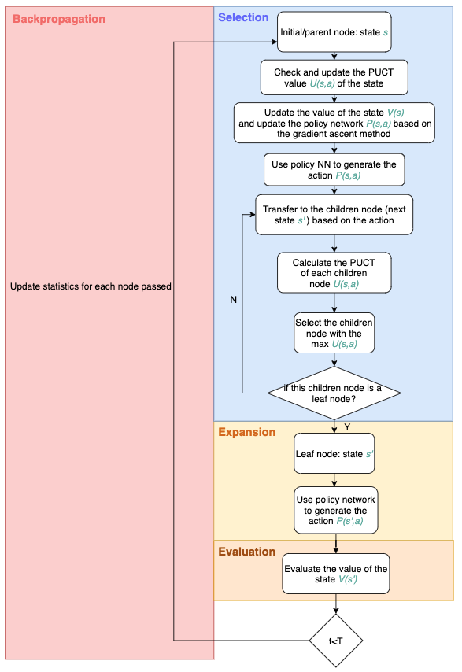

### 5.0. Define State, Action and Value Function

- **Service Action**. Suppose a service $T$ contains a sequence of ports. Then 

    - Service Action is denoted by $a = (p, l)$ where $p\in\mathcal{I} = \{P1,P2,P3,P4,P5,P6,P7\}$ means a port in the pool of ports and $l\in(0, 1, ..., |T|-1)$ means a location related to $p$. 

    - Rules:

        - If $p\not\in T$, then **insert** $p$ into $T$ at the location $\ell$. 

            For example, if $T = (P1,P2,P3)$ and $a = (P4,0)$, then the updated line $T' = (P4,P1,P2,P3)$. 

        - If $p\in T$, meaning that there is an element $T.p$ in service. Then, there are two sub-cases:

            - If $l$ is in the neighborhood edges of $T.p$, then **delete** $p$ from $T$. 

                For example, if $T = (P1,P2,P3)$ and $a = (P1,0)$ or $a=(P1,1)$, then the updated line $T'=(P2,P3)$. 

                Mathematically, this case accurs when $p=T[l]$ or $p=T[\text{previous of } l]$. 

            - If $l$ is not in the nerighborhood edges of $T.p$, then **add** $p$ into $T$ at the location $l$. 

                For example, if $T=(P1,P2,P3)$ and $a=(P1,2)$, then the updated line $T'=(P1,P2,P1,P3)$. 

                Mathematically, this case accurs when $p\not=T[l]$ and $p\not=T[\text{next of }l]$. 

            - If service line has only two ports, then cannot delete ports from the line. 

    - By these rules, we actually get the broadest variations of lines.

    - Further rules to reduce the action space:
        - Restrict on the limit of the number of visit. 
        - ... (See the Section 2.2.3.) 

- **Graph Action** is denoted by $(a_1,a_2)$.

- **Value function**. Suppose we allow for $k$-step adjustment, then the value of state $S$ is the best reward we can achieve in these adjustments. 

    - At each state $S$, there is a current state reward $R(S)$. 

    - The value of the state is 
        $$
        V(S_0) = \sum_{k=0}^{\infty}\beta^{k}R(S_k)
        $$
        where $S_k$ is the updated state by applying action $a_1, ..., a_{k-1}, a_k$. 


### 5.1. Classical Method: Breadth-First Search (BFS)

#### (1) Literature

- Victor-Alexandru Darvariu, Stephen Hailes and Mirco Musolesi, (2022), Planning spatial networks with Monte Carlo tree search, DOI: [10.1098/rspa.2022.0383](https://doi.org/10.1098/rspa.2022.0383). 
- Levente Kocsis and Csaba Szepesvari, Bandit based Monte-Carlo Planning, http://ggp.stanford.edu/readings/uct.pdf
- AlphaGo Zero: Starting from scratch (18 October 2017). https://deepmind.com/blog/article/alphago-zero-starting-scratch
- Monte-Carlo Tree Search Solver. https://dke.maastrichtuniversity.nl/m.winands/documents/uctloa.pdf

- David Silver, Julian Schrittwieser, Karen Simonyan, Ioannis Antonoglou, Aja Huang, Arthur Guez, Thomas Hubert, Lucas Baker, Matthew Lai, Adrian Bolton, et al. **Mastering the game of go without human knowledge**. nature, 550(7676):354–359, 2017.https://discovery.ucl.ac.uk/id/eprint/10045895/1/agz_unformatted_nature.pdf

- Tong, Z., Liang, Y., Sun, C., Rosenblum, D. S., & Lim, A. (2020). Directed graph convolutional network. arXiv preprint arXiv:2004.13970.https://arxiv.org/pdf/2004.13970 

#### (2) Steps: A "Myopic Mind" Algorithm

We are building a search tree. In each tree node, we store the following items:

- sum value 
- number of visits $n$. 

Build a root node (default state $T1, T2$):

```python
MCT_rootnode = cam.MonteCarloTreeSearchNode(graph)
print(MCT_rootnode.graph.services) # print out the root state
```

> [[1, 2, 3, 4], [1, 4, 5, 6, 7]]

For the root node, currently

- Sum value of root node ($q$) = value of $S_0$. 

- Visited number ($n$) = 1. 

Looping for 200 times:

1. **Selection**. 

   Find the leaf child with highest UCB score, traversed from the root node and calculate the score of all its children. There are two selections of scores: UCB of child node $i$ is 
   $$
   UCT = \frac{q_i}{n_i} + c\sqrt{\frac{ln(N_i)}{n_i}}
   $$
   or PUCT, which considers a prior probability 
   $$
   PUCT = Q_i + \frac{c P_i\sqrt{N_i}}{1+n_i}
   $$
   where $N_i$ is the total visited number of the **parent** of the child node $i$, and $Q_i = q_i/n_i$ if $n_i>0$ and 0 otherwise. 

   After picking the best child node, we check whether it has a child node. If yes, then it is not a leaf node and we repeat what we have done to the root node, until we find one that has no children. 

   **Example**.

   - Round 0: we just find the root node, since it has no child node yet. Then we move to step 2. 
   - Round 1: we just randomly pick one of all child nodes of the root, since the UCB score of all child nodes are $\infty$. For example, we select child node 1. Then we move to step 2. 

2. **Rollout, Expansion & Back-propogration**: 

   Let's denote by $c$ the selected leaf node. 

   (i) If the selected leaf node $c$ has **not** been explored ($c.n=0$), then 

   - **Rollout**. 

       Simulate a path of nodes whose length `n_steps` $=k$ from the selected nodes, evaluate their immediate rewards $R(S_i), i = 0,1,..,k$ and update the value of the selected nodes. Remember that 

       $$
       V(S_0) = \sum_{k=0}^{\infty}\beta^{k}R(S_k)
       $$
       we randomly simulate a path of actions $a_1, a_2, ..., a_k$ (by the output of **policy network**) and generate the path of adjusted states $S^c_1, S^c_2, ..., S^c_k$. 
       
       Then, we calculate their immediate rewards $R(S^c_k)$, and add the maximum one to the **sum value** of the node $c$. 
       
       ```python
       def rollout(self, portgraph: PortGraph, n_steps: int, max_depth: int) -> float:
           """
           Input:
           		`n_steps`: the number of adjustments
       			`max_depth`: the maximum depth of the whole searching tree
       	Work:
       			1. Simulate paths of adjustments randomly
       			2. Evaluate the value of `self` after `sim_depth` steps of adjustments
       	Return:
       			self.value
           """
       ```
       
   - **Backpropogation**. 
   
       Update upwardly the value and number of visited of all upper nodes until the root node. 
   
       The value of the upper node is updated by 
       $$
       \tilde{V}(S^{\text{c.parent}}) \longleftarrow \frac{N_k}{1+N_k}V(S^{\text{c.parent}}) + \frac{\beta}{1+N_k} \left[R(S^{\text{c.parent}}) + V(S^c)\right]
       $$
       where $V^{(k)}(S^{\text{c.parent}})$ is the old **averaged** $k$-step value. We add $\tilde{V}^{(k)}(S^{\text{c.parent}})$ to the sum of $k$-step value of the parent node, and add its number of visit by 1. 
   
       Meanwhile, in the backpropogration, each updation of values means a **correction** of the previous estimation of the true values. 
   
       ```python
       def back_propagate(self, value: float):
           """
       	Input:
       			`value`: the value of `self`
       	Work:
       			1. Update the summed value and number of visits of all upper nodes
       			2. Update neural network for each upper nodes
       	"""
       ```
   
   (ii) If the selected leaf node has been explored ($n \ge 1$), then 
   
   - **Expansion**. 
   
       Fully expand all its child nodes.
   
   **Example**.
   
   - Round 0: since the root node $c$ has not been visited, $n=0$, we will expand the root node and create all child nodes.
   - Round 1: since the visited number of child node 1 is zero, we rollout from the child 1.
   
3. Back to Step 1. (next round) 


### 5.2. Neural Network

#### (1) Update the policy network

* ==The objective function==

  $$J(\theta) = \mathbb{E}_{\pi} \left[ V(s) \right]=\sum_{a \in \pi} \left[ Q^{\pi}(s, a) \pi_{\theta}(a|s) \right]$$

* Update the policy network *P(s,a)* based on the gradient ascent method

  $$\nabla_{\theta} J(\theta) = \mathbb{E}_{\pi} \left[ Q^\pi(s,a) \nabla_{\theta} \log \pi_{\theta}(a|s) \right]$$

  

  The process is pretty straightforward:

  1. Initialize the policy parameter $\theta$ at random.
  
  2. Generate one trajectory on policy $\pi_{\theta}: s_1, a_1, r_2, s_2, a_2, \ldots, s_T$.
  
  3. For $t=1, 2, \ldots, T$:
     1. Estimate the return $V(s)$;
     
     2. Update policy parameters: $\theta \leftarrow \theta + \alpha \gamma^t Q^{\pi}(s, a) \nabla_{\theta} \log \pi_{\theta}(a_t | s_t)$
     
        

#### (2) Definition of  the action

$T$ is an $$ n \times n \times m $$ matrix, $n$ is the number of ports in the service network ($i$ is the is the departure port, $j$ is the destination port), $m$ is the number of service lines.

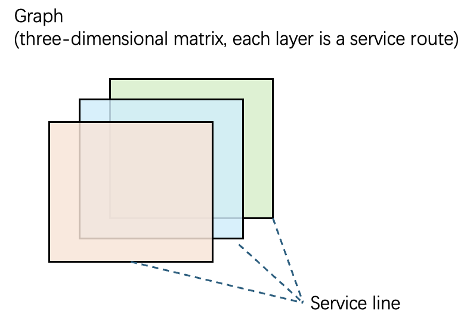

For each $l=1, ..., m$:

​	For each $k=1, ..., n; k \neq i, j$:

​		If $T_{ij}^l=1, T_{ik}^l=0$ and $T_{kj}^l=0$; $T_{ij}^l\leftarrow 0, T_{ik}^l \leftarrow 1, T_{kj}^l\leftarrow 1$; <!--add a port in a service line-->

​		if $T_{ij}^l=0, T_{ik}^l=1$ and $T_{kj}^l=1$; $T_{ij}^l\leftarrow 1, T_{ik}^l \leftarrow 0, T_{kj}^l\leftarrow 0$; <!--remove a port in a service line-->

​		otherwise, $T_{ij}^l$ doesn't update.


For example, $T$ describes a service line (**In-degree Adjacency Matrix**)

Original Line:

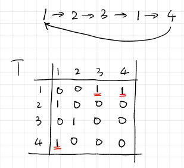


Add:

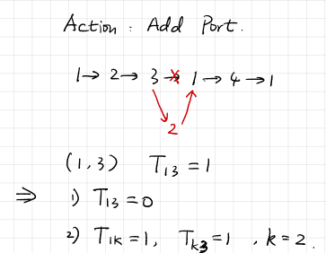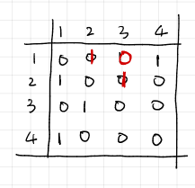


Delete:

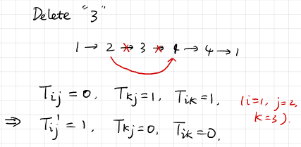 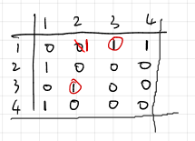 


#### (3) Directed Graph Convolutional Network

The first-order adjacency matrix for directed graphs: $A_F$:

$$
A_F (i, j) = A_{\text{sym}}(i, j)
$$

$A_{\text{sym}}$ is the symmetric form of the adjacency matrix. $A_{\text{sym}}$  represents the service network without directions. The assignment rules for $A_{\text{sym}}(i, j)$ are as follows:

- If there is no service line from port $i$ to port $j$, and no service line from port $j$ to port $i$, then $A_{\text{sym}}(i, j) = 0$;
- If there is at least one service line from port $i$ to port $j$, or if there is at least one service line from port $j$ to port $i$, then $A_{\text{sym}}(i, j) = 1$;

**Note**: If the graph has weights, the elements of the adjacency matrix are not limited to 0 and 1, hence the values of $A_{\text{sym}}$ are also not confined to 0 and 1.

Then the second-order in-degree adjacency matrix $A_{s_{in}}$ and the second-order out-degree adjacency matrix $A_{s_{out}}$ are proposed as follows:

$$
A_{s_{in}} = \frac{\sum_{k} A_{k,i} A_{k,j}}{\sum_{k} A_{k,v}}
$$

$$
A_{s_{out}} = \frac{\sum_{k} A_{i,k} A_{j,k}}{\sum_{k} A_{v,k}}
$$

In the above formulas, $A_{s_{in}}$ and $A_{s_{out}}$ calculate the second-order connectivity strength between ports by utilizing the structural properties of the graph, where $v$ in the denominator represents all ports that could possibly be connected to ports $k$. $A_{m,n}$ represents the edge weight between nodes $m$ and $n$ in the original graph.

Three representations for the adjacency of directed graphs are proposed:

* Undirected edge information in the network

$$
Z_F = \tilde{D}_F^{-\frac{1}{2}} \tilde{A}_F \tilde{D}_F^{-\frac{1}{2}} X \Theta
$$

* Directed edge information in the network

1. In-degree information 

$$
Z_{s_{in}} = \tilde{D}_{s_{in}}^{-\frac{1}{2}} \tilde{A}_{s_{in}} \tilde{D}_{s_{in}}^{-\frac{1}{2}} X \Theta
$$

2. Out-degree information 

$$
Z_{s_{out}} = \tilde{D}_{s_{out}}^{-\frac{1}{2}} \tilde{A}_{s_{out}} \tilde{D}_{s_{out}}^{-\frac{1}{2}} X \Theta
$$

Wherein, $\Theta$ are the learned parameters [$W$, $b$ ] in the linear transformation operations (i.e., the linear transformations at each port in GCN without the activation function), $X$ is the feature martix of the ports.

For each layer of the GCN, $\tilde{A}_x = A_x + I$, $\tilde{D}_x = D_x + I$, $x \in \{F, s_{in}, s_{out}\}$. For the degree matrix $D_x$ of the adjacency matrix $A_x \in \mathbb{R}^{n \times n}$, where $x \in \{F, s_{in}, s_{out}\}$, the calculation rule is (the same as the calculation rule for the degree matrix in GCN):
$$
D_x(i, i) = \sum_{j} A_x(i, j)
$$

- The architecture of Directed Graph Convolutional Network is:

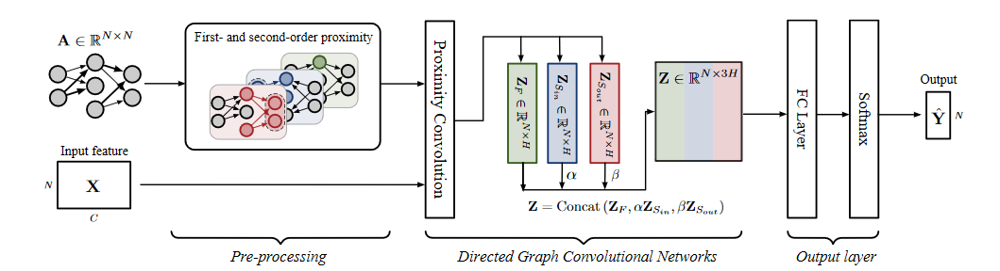


The function to compute the feature matrix $\tilde{Y}$ is defined as $f(X, A)$，$\tilde{Y}$ represents the directed graph:

$$
\begin{align}
\tilde{Y} &= \text{Concat}[ReLU(Z_F),\alpha ReLU(Z_{s_{in}}), \beta ReLU(Z_{s_{out}})] \notag \\
&= \text{Concat}[ReLU(\tilde{D}_F^{-\frac{1}{2}} \tilde{A}_F \tilde{D}_F^{-\frac{1}{2}} X \Theta^{(0)}), \alpha ReLU(\tilde{D}_{s_{in}}^{-\frac{1}{2}} \tilde{A}_{s_{in}} \tilde{D}_{s_{in}}^{-\frac{1}{2}} X \Theta^{(0)}), \beta ReLU(\tilde{D}_{s_{out}}^{-\frac{1}{2}} \tilde{A}_{s_{out}} \tilde{D}_{s_{out}}^{-\frac{1}{2}} X \Theta^{(0)})] 
\end{align}
$$


Where, $\alpha$ and $ \beta$ are learnable parameters. Furthermore, if we consider fully connecting them and then use softmax to output the action probability, the model is extended to:
$$
\hat{Y} = \text{softmax}(ReLU(\tilde{Y}\Theta^{(1)}))
$$


​	

#### (4) Algorithm framework of the Directed Graph Convolutional Network applied in this network optimization problem

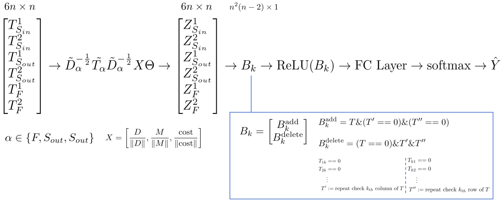
